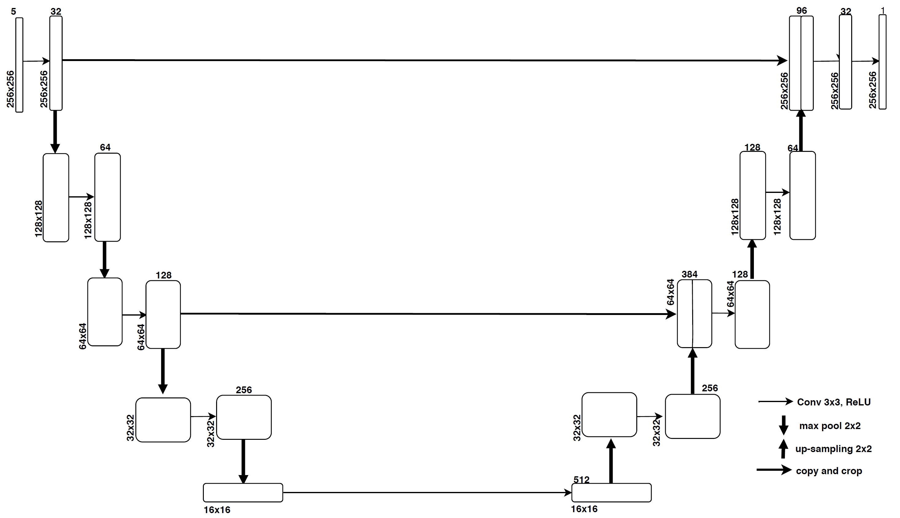
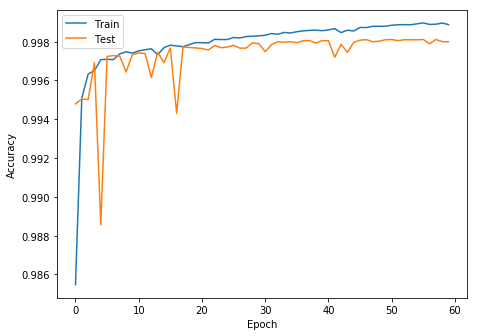
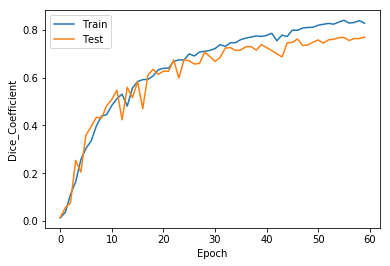
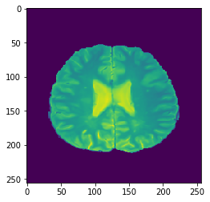
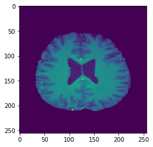
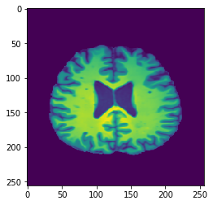
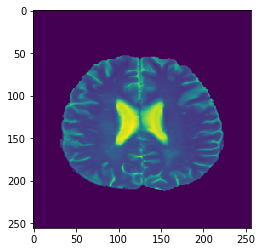
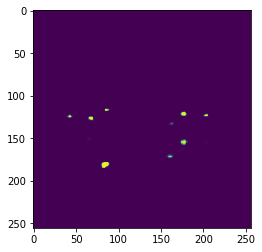

# Multiple-Sclerosis-Lesion-Segmentation
## INTRODUCTION
MS is a long-term, or persistent, condition that affects the
central nervous system (CNS) which often leads to disability. The CNS is made up of optic nerve, brain and spinal cord.
Hardening of tissue in the body is defined as sclerosis. In MS,
scar tissue appears in the CNS. This leads to travelling of
messages between the brain and rest of the body in an uneven
way.

Magnetic resonance imaging (MRI) is an important tool in diagnosing
MS. It can reveal telltale scars, also called lesions, on the brain or
spinal cord.
MRI allows doctors to see lesions in your Central Nervous
System(CNS). Lesions show up as white or dark spots, depending on
the type of scan.
## Dataset Acquisition
We have trained the whole convolutional network end to
end on MICCAI 2016 Dataset [7]. This dataset has MRI
Scans of 15 patients acquired in different image domains
with 5 different modalities T1-w, MPRAGE, FLAIR, T1-w
gadolinium enhanced and T2-w/DP contrast enhanced images.
All these modalities are of different resolutions for different
patients. The size of each modality for first 5 patients is
(144 * 512 * 512), next 5 patients is (128 * 224 * 256),
rest 5 patients is (261 * 336 * 336) respectively. The ground
truth images of each training subject were provided by seven
different human experts. The images were already provided
with necessary pre-processing like image de-noising, intensity
corrected and skull-stripped.

## Preprocessing
1. Image Concatenation and Resizing: As the dataset consists
of 3D images of 5 different modalities in Nifti format,
We have concatenated the first slice of the one modality with
first slice of other modalities, second slice of the one modality
with second slice of other modalities till nth slice of the one
modality with nth slice of other modalities. This concatenated
slice contains the slice of all 5 different modalities. The size of the input 
image is (256 * 256 * 5). 
2. Removing Null Data Samples: Repetitive and inapt data should be eliminated 
from training samples to reduce the quantity of features those exist
in the training samples to decrease the time taken to construct
the predictive model as well as enhance the predictive speed.
So, we have removed all the null samples.
3. Normalization and Standardization: All these images are normalized
to 0 to 1 improve training. 
        Normalisation(X)   = X / max(X) + epsilon
        Standardization(X) = (X - mean(X))/(std(X) + epsilon)
  where epsilon = 0.00001 (a very small value) and 
  X represents one channel of any modalityof size (h * w).
## PROPOSED METHOD

1. Network Architecture :
The CNN framework consists of 8 convolutional
layers , 1 sigmoid layer at the end, 4 Max-Pooling layers, 4
Upsampling layers. The architecture consists of a encoder and 5
a symmetric decoder. Each block in the encoder consists of
a convolutional layer followed by batch normalization and by
ReLU [13] activation function followed by a maxpooling layer
to capture context . Each block in the expanding path is same
as contracting path but it has upsampling layers that enables
precise localisation instead of maxpooling layers. The central
part between the contracting and expanding path contains 1
convolutional layer. Instead of concatenating all convolutonal
layers in encoder to decoded like in U-net, we concatenated
alternative convolutional layers. The output layer actually is a
convolutional layer followed by a sigmoid activation function
to detect whether there is lesion or not.

2. Training Phase : 
The presented architecture is trained on the well known
MICCAI 2016 data set of 15 Patients. After preprocessing
the dataset as mentioned above, we have 2834 Samples of size
(256 * 256 * 5) which is divided into training and testing data.
Initially the weights of all convolutional layers are initialized
by xavier initialization. The presented method is trained on
mini batch size of 32 with adam optimizer of learning rate
0.001. The loss function binary cross entropy is computed in
this paper. We have trained the model for 60 epochs.
3. Results :
The proposed segmentation framework using binary cross
entropy as loss function obtained the Accuracy of 96.79%
, DSC of 0.76 , sensitivity of 0.65 and specificity of 0.86.

4. Plots : 

## Conclusion :

To sum up, we have presented a light weighted deep learning
framework for the automatic MS lesion segmentation from the
MRI which outperform the U-Net and few other architectures
in terms of training time, accuracy and complexity.

#                                   Thank you 
